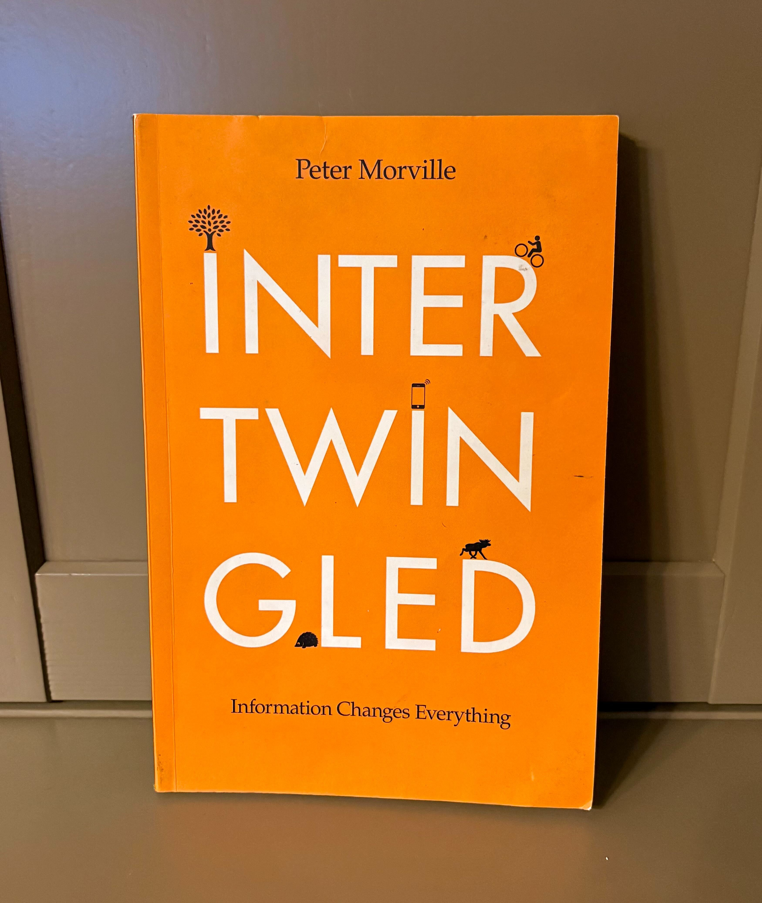

Some books name something you already understand but never had the language for. I love when that happens. _Intertwingled_ did that for me. Morville captures the strange, beautiful chaos of working inside complex organizations where information overlaps, ownership shifts, and every team has a different definition for the same thing.

It put words to the daily reality of navigating systems held together by history, politics, and well-meaning people doing their best in messy environments. When I’m deep in IA work for a site and everything starts to blur together, it’s oddly comforting to see that complexity acknowledged in print instead of treated like a failure of process.

>**Users do not experience channels. They experience ecosystems.**

My work has shown me how true this is. No matter how many systems we use or how many teams touch a workflow, people still expect one coherent experience. They follow whatever path helps them get a task done. And when something in one corner of the system is unclear, that confusion doesn’t stay contained. It spreads into every other touchpoint that depends on it. Even tiny inconsistencies ripple outward.

Looking around at content structures, calendar invites, Jira boards, enterprise systems, or even the design process itself, it becomes impossible to ignore that everything is connected. That’s really the heartbeat of _Intertwingled_: information behaves like a living ecosystem. And once you see that, you can’t unsee it. It shows up when I’m driving, scrolling on social media, reading the news, or watching a random Simpsons episode where chaos and systems-thinking accidentally collide. More on that later.
## Meaning, Not Menus
It’s easy to picture IA as boxes and tidy tree-like structures, but real people don’t think in categories. They think in meaning. They group things based on emotion, urgency, familiarity, personal history, panic, habit, or whatever their brain decides matters in the moment.

When I first meet with clients, one of the most common instincts I see is the urge to organize a website by how their department or group is structured internally. And honestly? It makes perfect sense. People reach for the mental models they already know. Their org chart is familiar. Their teams, budgets, reporting lines, and responsibilities are familiar. Internal structure is the story they live inside every day, so it feels like the natural way to arrange information.

But meaning works differently.

>**Users organize content by whatever helps them move forward.**  

I’ve seen this over and over in interviews and card sorts. The logic people use to find information rarely matches the logic an institution uses to store it. That gap is where IA gets interesting. It’s where the translation happens, from organizational logic to human logic, and those two things are almost never the same.

The job isn’t sorting pages. The job is helping people find what matters.
# Here's what hit the hardest:
## 1. Information isn’t neutral.
We treat content like it’s a polite, passive thing waiting inside a CMS. But Morville reminds us that information carries culture, power, politics, memory, emotion, and bias. It’s shaped by the people who wrote it, the people who approved it, the norms that govern it, and the agendas it supports.

It doesn’t just sit on a page. It participates in the environment. It has a personality.
## 2. IA is something humans live inside, not something they browse.
This line practically jumped off the page for me. Morville frames IA as an environment, not a navigation structure.

At work, we often use the house analogy, and it fits perfectly: IA is a house, not a hallway. It’s not just labeled doors — it’s the lived experience of moving through the space. A home can have beautiful labels and still be confusing to live in if the rooms don’t connect in ways that make sense.

People don’t browse IA; they inhabit it. They feel it. They hit its walls and weird corners. They notice when a door leads to a broom closet instead of the thing they hoped to find.

Meaning is in how the house _works_, not how it’s diagrammed.
## 3. Connections matter more than components.
Morville is subtle about this, but it’s everywhere in the book. We love to obsess over components and templates, especially in design systems, because they’re tangible. They’re neat. They give the illusion of order.

But the real story lives in the relationships between things. Not just between pages, but between people, tasks, expectations, tools, constraints, and the hidden systems humming underneath.

## 4. The invisible stuff does the heavy lifting.
IA is full of quiet forces: mental models, language, policies, internal politics, legacy decisions, expectations, and old habits someone set ten years ago that no one remembers but everyone still follows.

These things quietly shape how a system works and how users experience it. They’re the gravity of the environment.
## The Simpsons Snuck In, Somehow
Then there was this weird, random moment that really drove all this home, and in a place I did not expect. I do not even watch _The Simpsons_. It is just not a show I gravitate toward. But my husband had an old episode on one night, and within a few minutes I found myself having a full systems thinking moment.

It was the Frank Grimes episode (“Homer’s Enemy”), where Grimes joins the power plant and immediately realizes that nothing in this workplace makes sense, at least not to him. Homer sleepwalks through his job with zero effort, zero expertise, and somehow endless praise. And the wildest part is that everyone else acts like this is totally normal. His coworkers do not question it. Why? Because they have adapted to the system they live inside. They have accepted its quirks, shortcuts, inconsistencies, and unwritten rules as “just the way things are.”

_Image credit: The Simpsons, Season 8 Episode 23 “Homer’s Enemy,” 20th Century Fox Television._

To Grimes, the ecosystem is shocking. To everyone else, it is invisible.

He is basically the only person in Springfield doing a heuristic evaluation. He is pointing out architectural flaws, mismatched expectations, illogical patterns, broken workflows, and everyone else just shrugs, because the mental model of the organization has swallowed the actual experience.

That is the exact dynamic Morville writes about:

- People experience systems differently depending on their position.
- Meaning emerges from context, not components.
- Invisible structures do more shaping than visible ones.
- Environments can normalize chaos so thoroughly that users stop noticing the friction.

What looks like a comedy bit becomes a lesson in interconnected systems. Two people in the same architecture inhabit two different realities. The sense of a system is defined by familiarity, not logic. The environment shapes meaning even when the structure is objectively absurd. Normalization hides inconsistencies until someone new, like Grimes, steps in and sees them clearly.

It's ridiculous, it's funny, kind of painful, and it perfectly mirrors Morville’s point: users live inside ecosystems they did not design, and meaning is shaped by the structure around them.
## Why This Matters
Reading _Intertwingled_ did not change the complexity of my work. It changed the way I understand it. The chaos is not accidental. The overlaps are not failures. The inconsistencies are not signs that something went wrong. They are signs that systems are living environments full of people, history, tension, gaps, and good intentions.

Users are not looking for perfectly labeled boxes. They are moving through the architecture trying to make meaning. My job is to shape the environment so they can.

And once you start seeing that, you notice the patterns everywhere.
