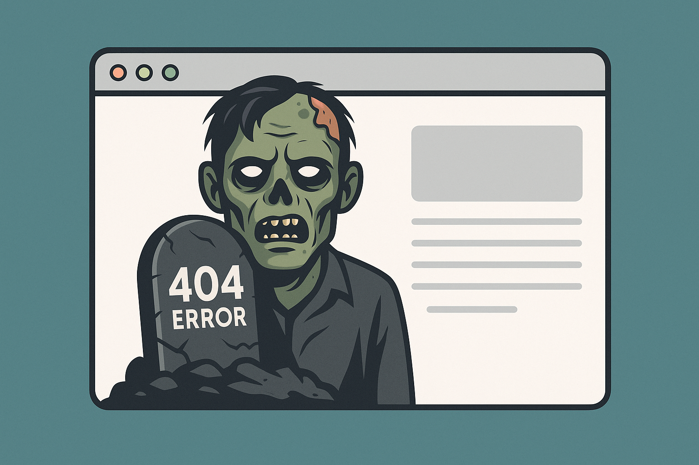

## TL:DR

A URL sitemap is the Hoarders house: overstuffed rooms, forgotten boxes, mystery piles, and content no one wants to claim. A visual sitemap is the Marie Kondo version of the same space: intentional, organized, and shaped around what users actually need. You need both to understand what you have and what you want the experience to be.

---

## What a URL sitemap actually is

In UX and information architecture, the word "sitemap" gets thrown around as if it describes one thing. In reality, there are two completely different versions: the URL sitemap and the visual sitemap. 

A URL sitemap is the full inventory of every page that exists on your site. Think of it as the behind the scenes footage of your website. Nothing is curated. Nothing is simplified. It is the honest truth of what is out there.

It looks like a long list or a CSV export. It often surprises people. It usually scares stakeholders. And it is priceless for IA work.

```
https://company.com/
https://company.com/products
https://company.com/products/analytics-suite
https://company.com/products/analytics-suite/pricing
https://company.com/products/analytics-suite/faq
https://company.com/resources
https://company.com/resources/case-studies
https://company.com/resources/case-studies/healthcare
https://company.com/resources/case-studies/finance
https://company.com/blog
https://company.com/blog/2024/optimizing-workflows
https://company.com/blog/2024/ui-patterns-guide
https://company.com/legal/privacy
https://company.com/legal/terms
https://company.com/system/internal/audit-logs
https://company.com/system/internal/data-export
```

**What a URL Sitemap Helps You Discover**

- All pages, even the forgotten, dusty ones from six site admins ago  
- Deep nesting that no user would ever willingly explore  
- Duplicate content that quietly appeared over the years  
- Legacy paths that hurt SEO or confuse navigation  
- Content sprawl that tells the story of a site with no governance  
- Zombie pages that still appear in search results even though no one remembers creating them



In higher ed and enterprise settings, large parts of a site live behind:

- Role-based permissions  
- Buried admin pages  
- Microsites  
- Legacy leftovers  

These never show up in a visual sitemap but absolutely affect technical debt, indexing, and governance. A URL sitemap often becomes the clearest reflection of an organization’s internal realities. When the structure is chaotic, the workflows and ownership patterns usually are too.

**When You Use It**

Right at the beginning of a project. Especially during content audits, technical migrations, and any redesign effort where the current state needs to be understood before the future state can be shaped.

**Why It Matters**


Information architecture writers like Peter Morville, Louis Rosenfeld, Abby Covert, and Jorge Arango have been consistent about one thing:

Structure shapes meaning.

In practice, that means cluttered, chaotic, or inconsistent URL structures can make a site harder for both humans and search engines to interpret. Even though modern search engines in 2025 rely far more on semantic signals, structured data, and user intent models, they still work best when a site’s content landscape is coherent. Clear hierarchy, predictable patterns, and logical groupings help crawlers understand which pages matter, how they relate, and which should rank together.

---

## What's a visual sitemap?

A visual sitemap is a conversation tool. It exists so teams can align on mental models, not to document every URL in the system. It is **not** a full system inventory. It is a diagram that represents **what the user can access in the interface**, organized in a clear, conceptual hierarchy.

In other words, it models *the navigation and structure of the visible experience*, not the hidden layers underneath. It stays tightly scoped to **surface structure**, and that is by design. Navigation reflects the structure, but it is not the structure. A visual sitemap shows the model that navigation will express, not every page that physically exists in the system.

Visual sitemaps intentionally hide complexity. They do not show admin pages, taxonomy terms, system utilities, or controlled-access content because none of those shape the user’s mental model.

As Optimal Workshop explains,  
> “Information architecture defines the relationships and hierarchy that users experience. It is not a mirror of the entire system. It is a model that reflects the parts of the environment that matter to the user.”  
> — [*Information Architecture vs Navigation: Creating a Seamless User Experience*](https://www.optimalworkshop.com/blog/information-architecture-vs-navigation-creating-a-seamless-user-experience)

**What a Visual Sitemap Helps You Capture**

- The pages that appear in menus, submenus, and UI pathways  
- Relationships the user can actually traverse  
- The conceptual hierarchy that defines the experience  
- The mental model you want users to understand  
- How content surfaces to support user goals  

A strong visual sitemap also scales. It gives you a structure that can grow without collapsing into deep, confusing hierarchies.

**When You Use It**

Design discussions, IA alignment sessions, stakeholder reviews, navigation planning, card sorting synthesis, and anything that clarifies how the *experience* fits together.

---

## Who each sitemap is for

These two artifacts do not speak to the same audience.

- **URL sitemap:** IA practitioners, developers, SEO teams, content owners, migration teams  
- **Visual sitemap:** Designers, strategists, leadership, stakeholders, and anyone who needs to understand the *experience*, not the system

They coexist because each answers different questions at different points in the workflow.

---

## Closing thoughts

The power of information architecture comes from treating these as separate layers, each with its own purpose, language, and audience. When used together, they create websites that make sense both behind the scenes and on the surface.

The work of IA happens in the space between the two maps. One shows the raw material. The other shows the shape it should take for the user.